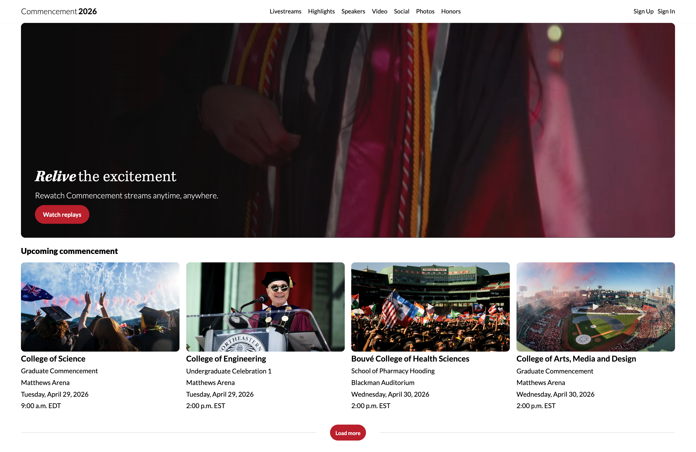
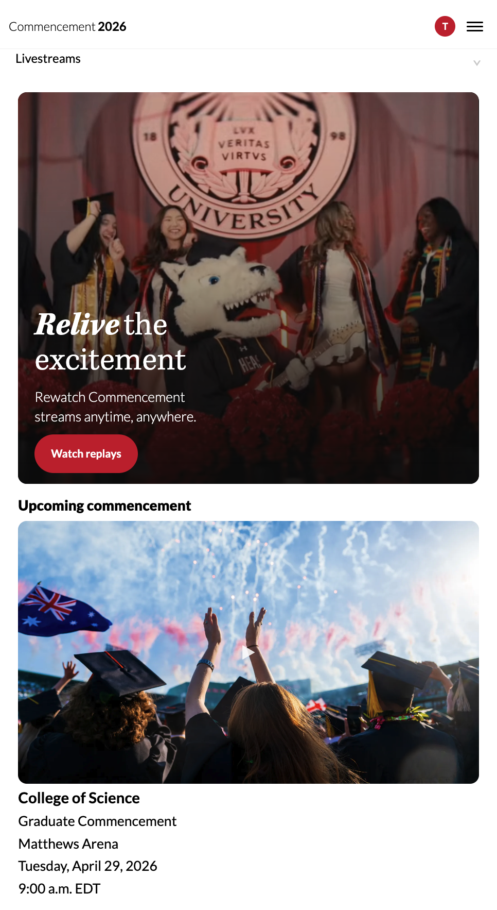
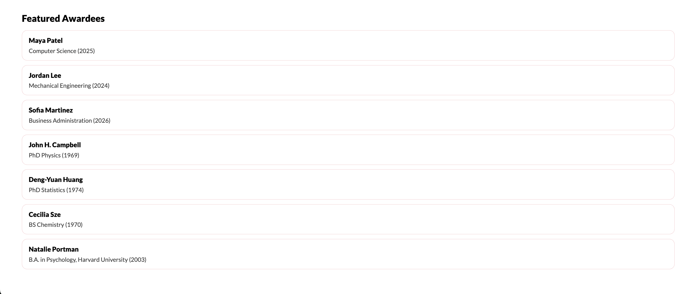

# Commencement CMS

A full-stack MEN app for managing commencement awardees.

## Screenshots

### Desktop

### Mobile

## Screenshots

<table>
  <tr>
    <td align="center"><strong>Home - Desktop</strong></td>
    <td align="center"><strong>Home - Mobile</strong></td>
  </tr>
  <tr>
    <td></td>
    <td></td>
  </tr>
  <tr>
    <td align="center"><strong>Awardees - Desktop</strong></td>
    <td align="center"><strong>Awardees - Mobile</strong></td>
  </tr>
  <tr>
    <td></td>
    <td></td>
  </tr>
</table>

## Description
Commencement CMS is a Node/Express/MongoDB application that allows users to sign up, sign in, and manage commencement awardee records.  
It was inspired by the need to organize graduation-related content in a clean, structured, and editable system.

This app includes:
- session-based authentication
- full CRUD for awardees
- authorization so only signed-in users can manage data
- a public-facing landing page with a custom header + hero section
- responsive styling for desktop and mobile

## Why I Built This
I chose this project because I wanted to build something tied to a real-world use case.  
A commencement CMS felt meaningful, practical, and strong for showing full-stack CRUD skills in a more polished and branded experience.

## Getting Started
### Live App
[Deployed App](https://commencement-cms.onrender.com/)

### Planning Materials
[Trello Project Planning Board](https://trello.com/b/6cHjWoIg/nu-commencement-cms-project-planning)

### GitHub Repository
[GitHub Repo](https://github.com/thara-messeroux/commencement-cms.git)

## Technologies Used
- JavaScript
- Node.js
- Express.js
- MongoDB
- Mongoose
- EJS
- CSS
- express-session
- connect-mongo
- bcrypt
- Render

## Attributions
- Northeastern Commencement content and visual inspiration were used as design inspiration for this educational project.
- Render was used for deployment.
- Google Fonts / system fonts were used for web typography where applicable.

## Next Steps
- Add search and filtering for awardees
- Improve admin dashboard UI
- Add image uploads for awardees
- Add category filtering for different colleges or commencement groups
- Add stronger form validation and success/error messages

## Project Requirements Covered
- Uses EJS templates for rendering views
- Uses session-based authentication
- Organized using MVC structure
- Includes related data beyond the User model
- Includes full CRUD functionality
- Includes authorization rules
- Deployed online
- Uses RESTful routing conventions
- Includes styled UI with responsive layout
- Includes a README with project details, technologies, attributions, and next steps

## Step Log

### Step 1 - Project Setup
- Created the Commencement CMS project folder and starter MVC structure.
- Installed core dependencies for Express, MongoDB, EJS, sessions, and auth.
- Added `.gitignore` to protect secret files and keep the repo clean.

**Why:** A clean foundation makes the rest of the app faster and safer to build.

**Engineering principle:** Separation of concerns (MVC) + clean project structure.

## Commit Prefix Cheat Sheet

We use **Conventional Commits** to keep the Git history clean and easy to understand.

Format:

type: short description

Example:
feat: add awardee CRUD routes

---

| Prefix | What it means (simple) | When to use it | Example for this project |
|------|------|------|------|
| feat | New functionality | When you add a new feature | `feat: implement session-based authentication` |
| fix | Fixing a bug | Something was broken and now works | `fix: prevent unauthorized awardee edits` |
| docs | Documentation only | README updates or explanations | `docs: add README with setup and deployment instructions` |
| style | Visual changes | CSS, layout, UI tweaks | `style: add responsive layout for admin dashboard` |
| refactor | Code cleanup | Improve code without changing behavior | `refactor: simplify awardee controller logic` |
| chore | Project setup / maintenance | config, dependencies, environment | `chore: initialize express server and project scaffold` |
| test | Tests added or updated | adding or fixing automated tests | `test: add user authentication tests` |

---

## Real Examples For This Project

feat: implement session-based authentication  
feat: add awardee CRUD routes and controllers  
feat: render awardees on public landing page  
fix: prevent unauthorized awardee edits  
style: add responsive layout for admin dashboard  
docs: add README with setup and deployment instructions  
chore: initialize express server and project scaffold  

---

## Why This Matters

Clean commits help developers quickly understand:

• what changed  
• why it changed  
• when it changed  

This is a **professional engineering practice used in real production teams.**

---

## 🧠 Architecture (MVC Overview)

This project follows the MVC (Model-View-Controller) pattern to keep the code organized and easy to maintain.

| Part | What it does | Example |
|---|---|---|
| Model | data | Stores awardee info like name, degree, year |
| View | what you see | Displays awardees on the page |
| Controller | handles actions | Decides what happens when a user clicks something |
| Middleware | checks rules (security) | Ensures user is signed in before accessing admin pages |
| Public | makes it look good | CSS, colors, fonts, layout styling |

**Simple summary:**
- Model = data  
- View = screen  
- Controller = logic  
- Middleware = security  
- Public = styling

---

### Step 2 - EJS Rendering Setup
- Enabled EJS as the view engine.
- Added reusable head and nav partials.
- Rendered the landing page from `views/index.ejs`.
- Added starter CSS from the public folder.

**Why:** This changed the app from plain text responses to real webpages.

**Engineering principle:** Reusability with partials and separation of concerns.

---

### Step 3 - MongoDB Connection
- Added MongoDB connection using Mongoose.
- Stored database URI inside `.env`.
- Confirmed connection with a console log.

**Why:** Enables persistent data storage for Users and Awardees.

**Engineering principle:** Environment configuration and database abstraction.

---

### Step 4 - Awardee Data Model

Created the `Awardee` model using Mongoose.

Fields:
- `name` – awardee name
- `degree` – program or degree earned
- `year` – graduation year
- `bio` – short description

Purpose:
Defines the structure of awardee records stored in MongoDB.

Engineering principle:
Clear data modeling using Mongoose schemas.

---

### Step 5 - User Model & Awardee Relationship
- Created the `User` model with `username` and `password`.
- Added a `createdBy` field to the `Awardee` model.
- Linked each awardee to the user who created it.

**Why:** This satisfies the relational data requirement and prepares the app for ownership-based authorization.

**Engineering principle:** Data relationships and access control.

---

### Step 6 - Session Authentication
- Added sign-up, sign-in, and sign-out routes.
- Used bcrypt to hash passwords before storing them.
- Added session-based login state with `express-session` and `connect-mongo`.

**Why:** This gives the app secure user authentication and keeps users logged in across requests.

**Engineering principle:** Security, authentication, and session management.

---

### Step 7 - Awardee CRUD
Implemented full CRUD functionality for Awardees.

Features:
- Create new awardees
- View all awardees
- View individual awardee details
- Edit awardee information
- Delete awardees

- Added protected awardee routes for index, new, create, show, edit, update, and delete.
- Built the `awardees` controller using RESTful patterns.
- Added ownership checks so users only manage their own awardees.
- Created EJS pages for listing, creating, viewing, editing, and deleting awardees.

**Why:** This is the core CMS functionality required by the project.

**Engineering principle:** RESTful routing, CRUD operations, and authorization by ownership.

---

### Step 8 - Public Landing Page and View Middleware
- Added middleware to make the logged-in user available in all EJS views.
- Rendered awardees on the public landing page.
- Updated navigation to show different links for guests and signed-in users.

**Why:** This makes the CMS feel like a real public-facing commencement site while keeping admin actions protected.

**Engineering principle:** View context sharing and role-based UI behavior.

---

### Step 9 - Header + Hero + Upcoming Commencement Styling
- Redesigned the landing page header and hero section to match the approved Figma more closely.
- Added a looping hero video from the `public/videos` folder.
- Built a new “Upcoming commencement” card section under the hero.
- Added a responsive “Load more” divider/button area.
- Updated shared navigation for desktop and mobile layouts.
- Added clearer inline comments in EJS and CSS to explain key UI ideas.

**Why:** This makes the public landing page look more polished, presentation-ready, and closer to the intended Northeastern design system.

**Engineering principle:** Progressive enhancement, responsive design, reusable partials, and clean separation of structure (EJS) from styling (CSS).

**Key words:**
- **Hero** = the big welcome section at the top of a page
- **CTA** = call-to-action button that tells the user what to do next
- **Partial** = a reusable EJS file shared across pages
- **Static asset** = a file like CSS, image, or video that the browser can load directly
- **public folder** = the folder Express exposes to the browser
- **autoplay** = video starts automatically
- **loop** = video repeats automatically
- **Responsive design** = layout changes to fit desktop and mobile screens
- **Overlay** = a dark layer on top of media to make text easier to read